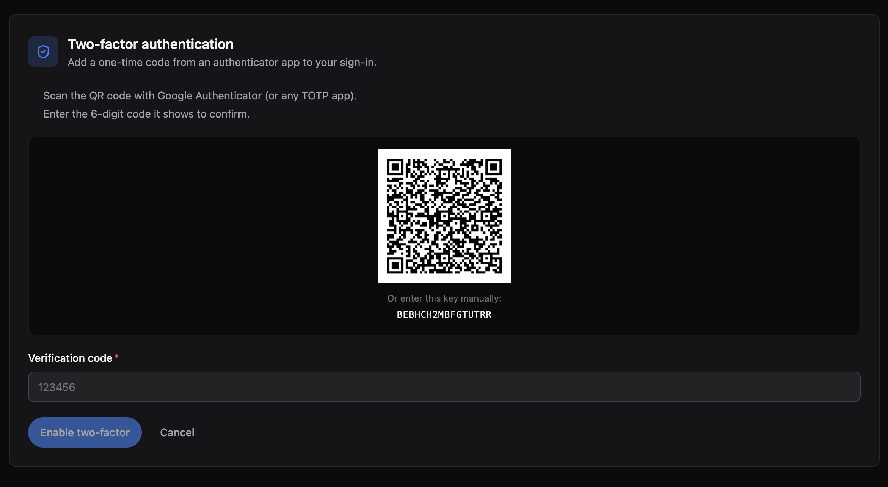
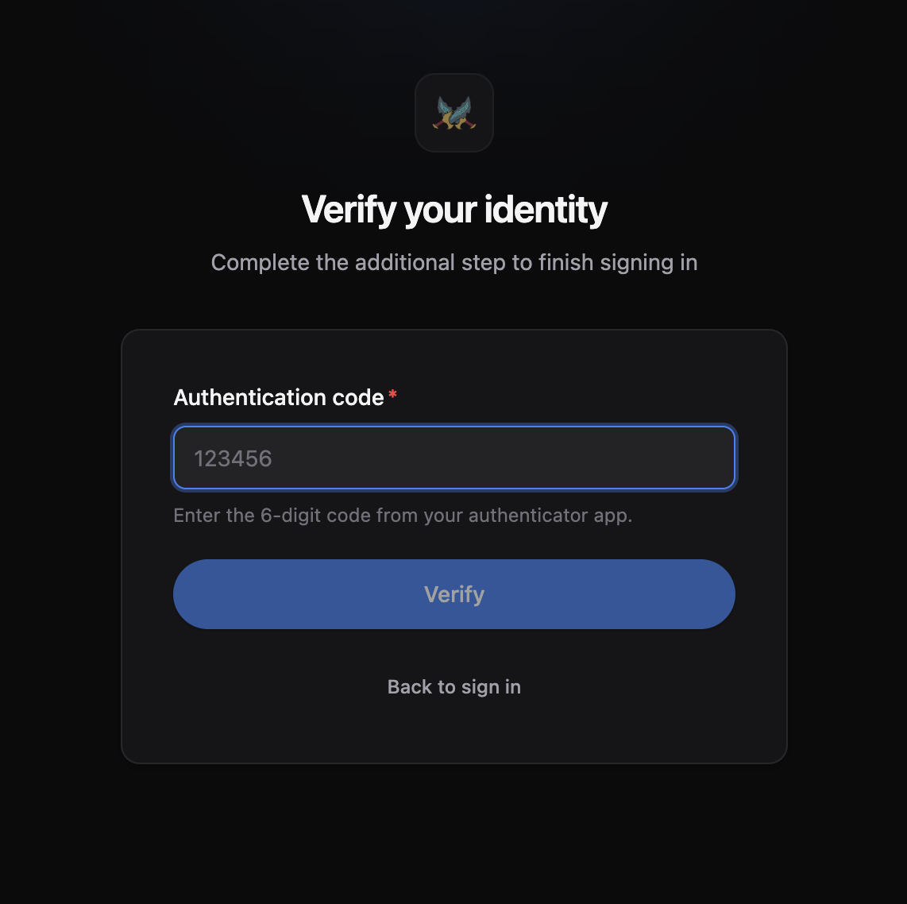

# @maxal_studio/kratosjs-plugin-2fa

Two-factor authentication (TOTP / Google Authenticator) for KratosJs panels.

Adds a verification step to the login flow and a self-service **Security › 2 Factor Auth**
settings page where each user enables, configures, or disables their own 2FA.





## Install

```bash
npm install @maxal_studio/kratosjs-plugin-2fa
```

## Setup

The plugin has two halves — register both.

### 1. Server

Add the plugin after `panel.auth(...)`:

```ts
import { TwoFactorPlugin } from '@maxal_studio/kratosjs-plugin-2fa';

panel
	.auth({
		/* ...your auth config... */
	})
	.plugins([new TwoFactorPlugin({ issuer: 'My App' })]);
```

`issuer` is the label shown in the user's authenticator app (defaults to `KratosJs`).

On a SQL driver the plugin registers its migration automatically; the `user_two_factor`
table is created on start.

### 2. Client

Add the plugin's client manifest in your admin entry:

```ts
import { mountAdminPanel } from '@maxal_studio/kratosjs-react';
import twoFactorClient from '@maxal_studio/kratosjs-plugin-2fa/client';

mountAdminPanel({ plugins: [twoFactorClient] });
```

That's it. A **2 Factor Auth** page appears under a **Security** group in the navigation, and
the login screen prompts for a 6-digit code whenever a user has 2FA enabled.

## Options

- **`issuer`** (default `'KratosJs'`) — name shown for the account in authenticator apps.
